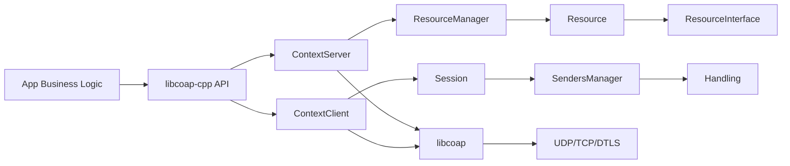
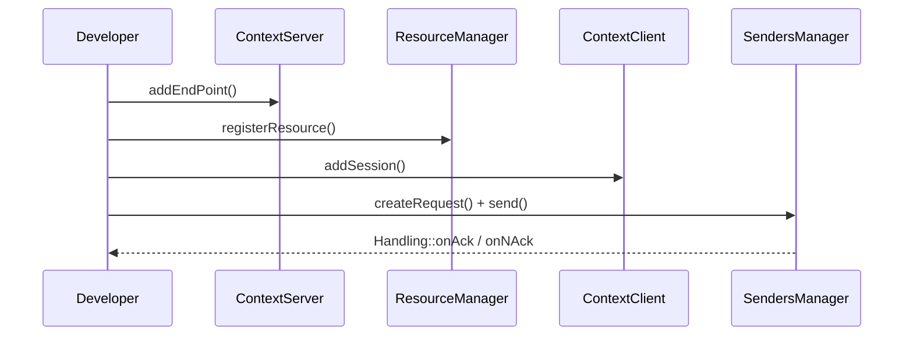

# libcoap-cpp

English | [中文](./README.md)

> A modern C++20 wrapper around **libcoap**: less boilerplate, cleaner abstractions, and smoother integration into real-world projects.

## Why use libcoap-cpp?

When teams use raw C-style `libcoap` directly, they often hit these issues:

- Lots of low-level lifetime handling across scattered code paths.
- Client/server logic becomes tightly coupled as the project grows.
- Callback routing and request-response correlation are hard to maintain.
- Business developers must understand too many protocol internals.

`libcoap-cpp` is designed to solve these pain points.

### Key benefits

- **Object-oriented API**: clear abstractions like `ContextServer / ContextClient / Session / Resource / Handling`.
- **Keeps libcoap power, adds C++ ergonomics**: protocol capability is preserved while API usage is simplified.
- **Higher development velocity**: request sending, resource registration, and ACK/NACK handling are straightforward.
- **Team-friendly architecture**: clear module boundaries for long-term maintenance.
- **CMake-first integration**: easy to embed into existing C++ build pipelines.

---

## Architecture at a glance



---

## Repository layout

```text
.
├── include/coap/          # public headers
├── src/                   # core definitions and implementations
├── examples/              # client/server examples
├── tests/                 # tests
├── doc/                   # docs and RFC references
├── cmake/                 # CMake helper files
└── CMakeLists.txt
```

---

## Requirements

### Required

- CMake >= 3.14
- C++20 compiler (GCC / Clang / MSVC)
- libcoap (`find_package(libcoap REQUIRED CONFIG)`)
- OpenSSL (`find_package(OpenSSL REQUIRED)`)

### Optional

- Doxygen (when `ENABLE_DOCS=ON`)

---

## Build and install

```bash
cmake -S . -B build
cmake --build build -j
```

Enable tests:

```bash
cmake -S . -B build -DENABLE_TESTS=ON
cmake --build build -j
ctest --test-dir build --output-on-failure
```

Install:

```bash
cmake --install build --prefix /usr/local
```

---

## Typical workflow



---

## Frequently used APIs

- `ContextServer`: manages server endpoints and resources.
- `ContextClient`: manages client sessions and keepalive/handshake.
- `ResourceManager`: register/remove/query resources.
- `ResourceInterface`: implement business behavior per request method.
- `SendersManager`: create and send requests.
- `Handling`: response callbacks and sender lifecycle handling.

Examples:
- `examples/server.cc`
- `examples/client.cc`
- `examples/ResourceInterfaceExample.h`
- `examples/HandlingExample.h`

---

## CMake options

- `ENABLE_TESTS` (default OFF)
- `ENABLE_EXAMPLES` (default ON)
- `ENABLE_DOCS` (default OFF)
- `MAKE_LIBRARY` (default ON)
- `MAKE_STATIC_LIBRARY` (default ON)

---

## FAQ

### `libcoapConfig.cmake` not found?

Point CMake to your libcoap install prefix:

```bash
cmake -S . -B build -DCMAKE_PREFIX_PATH=/path/to/libcoap/install
```

---

## License

No explicit LICENSE file is currently provided in this repository.
Please add and verify license compatibility before production distribution.
