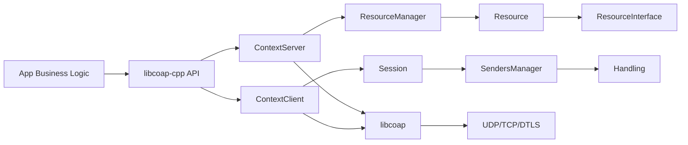
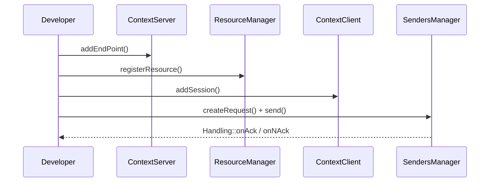

# libcoap-cpp

[English](./README.en.md) | 中文

> 一个基于 **libcoap** 的现代 C++20 封装库：更少样板代码、更清晰的抽象、更稳定的工程接入体验。

## 为什么要用 libcoap-cpp？

很多团队在直接使用 C 风格 `libcoap` 时，会遇到这些痛点：

- 需要手动管理较多底层对象生命周期，代码容易分散。
- 客户端和服务端逻辑耦合，项目变大后维护成本上升。
- 回调分发和请求响应关联逻辑复杂，不利于团队协作。
- 业务开发者需要频繁“跨层”理解协议细节，学习成本高。

`libcoap-cpp` 的目标就是解决这些问题。

### 这个库带来的核心好处

- **面向对象抽象，降低复杂度**：用 `ContextServer / ContextClient / Session / Resource / Handling` 等类型描述业务模型，结构更自然。
- **保留 libcoap 能力，同时更 C++ 化**：不屏蔽协议能力，但提供更易组合、更安全的接口。
- **开发效率更高**：资源注册、请求发送、ACK/NACK 处理路径清晰，减少样板代码。
- **更适合团队协作**：模块边界明确（资源、会话、消息、事件），便于分工与测试。
- **工程集成友好**：标准 CMake 方式接入，适配常见 C++ 工程体系。

---

## 一图看懂：架构关系



---

## 快速收益（适合谁）

- 想把 CoAP 项目做成“可维护工程”而不是“能跑 demo”的团队。
- 想在 C++ 项目中稳定接入 CoAP（而不是写一层一次性 glue code）。
- 需要同时开发客户端与服务端、并长期演进协议能力的场景。

---

## 项目结构

```text
.
├── include/coap/          # 对外头文件
├── src/                   # 核心类定义与实现
├── examples/              # client / server 示例
├── tests/                 # 测试
├── doc/                   # 文档与协议资料
├── cmake/                 # CMake 辅助文件
└── CMakeLists.txt
```

---

## 依赖与环境

### 必需

- CMake >= 3.14
- C++20 编译器（GCC / Clang / MSVC）
- libcoap（`find_package(libcoap REQUIRED CONFIG)`）
- OpenSSL（`find_package(OpenSSL REQUIRED)`）

### 可选

- Doxygen（开启 `ENABLE_DOCS=ON` 时）

---

## 构建与安装

```bash
cmake -S . -B build
cmake --build build -j
```

启用测试：

```bash
cmake -S . -B build -DENABLE_TESTS=ON
cmake --build build -j
ctest --test-dir build --output-on-failure
```

安装：

```bash
cmake --install build --prefix /usr/local
```

---

## 典型开发流程



---

## 核心 API（高频）

- `ContextServer`：管理服务端端点和资源。
- `ContextClient`：管理客户端会话与握手。
- `ResourceManager`：资源注册、移除、查询。
- `ResourceInterface`：按请求方法处理业务逻辑。
- `SendersManager`：创建并发送请求。
- `Handling`：处理响应回调与发送生命周期。

可直接查看：
- `examples/server.cc`
- `examples/client.cc`
- `examples/ResourceInterfaceExample.h`
- `examples/HandlingExample.h`

---

## CMake 开关

- `ENABLE_TESTS`：构建测试（默认 OFF）
- `ENABLE_EXAMPLES`：构建示例（默认 ON）
- `ENABLE_DOCS`：构建 Doxygen 文档（默认 OFF）
- `MAKE_LIBRARY`：构建库目标（默认 ON）
- `MAKE_STATIC_LIBRARY`：是否静态库（默认 ON）

---

## FAQ

### 找不到 libcoapConfig.cmake？

为 `libcoap` 设置安装路径，例如：

```bash
cmake -S . -B build -DCMAKE_PREFIX_PATH=/path/to/libcoap/install
```

### 这个库适合生产环境吗？

适合做工程化开发基座；上线前建议结合你们的 `libcoap` 编译选项、传输安全策略（TLS/DTLS）与压测结果评估。

---

## 文档与参考

- `doc/RFC7252-《受限应用协议》中文版.md`
- `doc/RFC7228 -《受限节点网络的术语》中文版.md`
- `doc/Doxyfile.in`

---

## 许可证

当前仓库未提供明确 LICENSE 文件。用于生产或分发前，请先补充许可证并完成依赖许可证审查。
