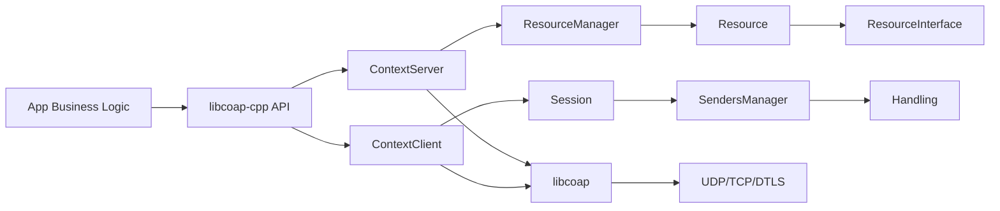

# libcoap-cpp

[English](./README.en.md) | 中文

> 一个基于 **libcoap** 的现代 C++20 封装库：更少样板代码、更清晰的抽象、更稳定的工程接入体验。

<p align="center">
  <a href="https://github.com/MrHulu/libcoap-cpp/stargazers"></a>
  <a href="https://github.com/MrHulu/libcoap-cpp/network/members"></a>
  <a href="https://github.com/MrHulu/libcoap-cpp/issues"></a>
  <a href="https://github.com/MrHulu/libcoap-cpp"></a>
</p>


💡 喜欢这个项目的话，欢迎 **Star ⭐ / Fork 🍴 / 分享 📣**，帮助更多开发者看到它。

## 🌟 为什么值得 Star？

- 🔧 **把“协议细节”还给框架层**：业务同学可以更专注资源和逻辑，而不是重复处理底层收发细节。
- 🧱 **更像现代 C++ 项目**：模块边界清晰，类型语义明确，便于代码审查与多人协作。
- 🪄 **上手成本低，迁移成本可控**：保留 libcoap 能力，不强绑业务架构。
- 📚 **文档 + 示例完整**：新成员可快速跑通并理解端到端通信流程。

## 🤔 为什么要用 libcoap-cpp？

很多团队在直接使用 C 风格 `libcoap` 时，会遇到这些痛点：

- 需要手动管理较多底层对象生命周期，代码容易分散。
- 客户端和服务端逻辑耦合，项目变大后维护成本上升。
- 回调分发和请求响应关联逻辑复杂，不利于团队协作。
- 业务开发者需要频繁“跨层”理解协议细节，学习成本高。

`libcoap-cpp` 的目标就是解决这些问题。

### 这个库带来的核心好处
### ✅ 这个库带来的核心好处

- **面向对象抽象，降低复杂度**：用 `ContextServer / ContextClient / Session / Resource / Handling` 等类型描述业务模型，结构更自然。
- **保留 libcoap 能力，同时更 C++ 化**：不屏蔽协议能力，但提供更易组合、更安全的接口。
- **开发效率更高**：资源注册、请求发送、ACK/NACK 处理路径清晰，减少样板代码。
- **更适合团队协作**：模块边界明确（资源、会话、消息、事件），便于分工与测试。
- **工程集成友好**：标准 CMake 方式接入，适配常见 C++ 工程体系。

---

## 一图看懂：架构关系
## 🧭 一图看懂：架构关系



---

## 🚀 快速收益（适合谁）

- 想把 CoAP 项目做成“可维护工程”而不是“能跑 demo”的团队。
- 想在 C++ 项目中稳定接入 CoAP（而不是写一层一次性 glue code）。
- 需要同时开发客户端与服务端、并长期演进协议能力的场景。
- 希望沉淀可复用 CoAP 基础设施、提升团队“交付速度 + 稳定性”的项目。

---

## 🧱 项目结构

```text
.
├── include/coap/          # 对外头文件
├── src/                   # 核心类定义与实现
├── examples/              # client / server 示例
├── tests/                 # 测试
├── doc/                   # 文档与协议资料
├── cmake/                 # CMake 辅助文件
└── CMakeLists.txt
```

---

## ⚙ 依赖与环境

### 必需

- CMake >= 3.14
- C++20 编译器（GCC / Clang / MSVC）
- libcoap（`find_package(libcoap REQUIRED CONFIG)`）
